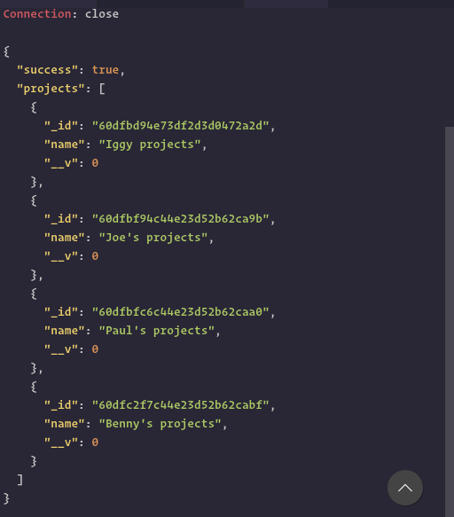

# Hypothetical Comment System

This project is based on Node, express and mongoDB for a RESTFUL API which provides hypothetical comment system where users can comment on other CLLCTVE members' projects.

- Create a simple comment system backend.

- GET all of the comments for a portfolio item.

- GET all of the projects.

- POST new comments as multiple users (you can just give us a couple user IDs to use).

- We should be able to test these routes ourselves via postman.

The screen below shows the information to be  displayed on the frontend.

### Users

FirstName field

### Comments

CommentContent field

### Projects

Name

[Live Demo](http://178.128.135.246:3000/)

## Register a user

    POST http://178.128.135.246:3000/api/register_user
    Content-Type: application/json

    {
    "firstName": "Clement"
    }

## Create a comment

    POST http://178.128.135.246:3000/api/create_comment
    Content-Type: application/json

    {
    "project": "60dfbf94c44e23d52b62ca9b",
    "user": "60dfc1dec44e23d52b62cab1",
    "content": "just awesome!"
    }

## Create a project

    POST http://178.128.135.246:3000/api/create_project
    Content-Type: application/json

    {
    "name": "Benny's projects"
    }

## Get all projects

    GET http://178.128.135.246:3000/api/projects
    Content-Type: application/json

## Get a single project

    GET http://178.128.135.246:3000/api/projects/60dfbd94e73df2d3d0472a2d
    Content-Type: application/json

## Get all comments to a single project

    GET http://178.128.135.246:3000/api/project_comment/60dfbf94c44e23d52b62ca9b
    Content-Type: application/json

## Get a single project

    GET http://178.128.135.246:3000/api/single_comment/60dfc28bc44e23d52b62cab8
    Content-Type: application/json
